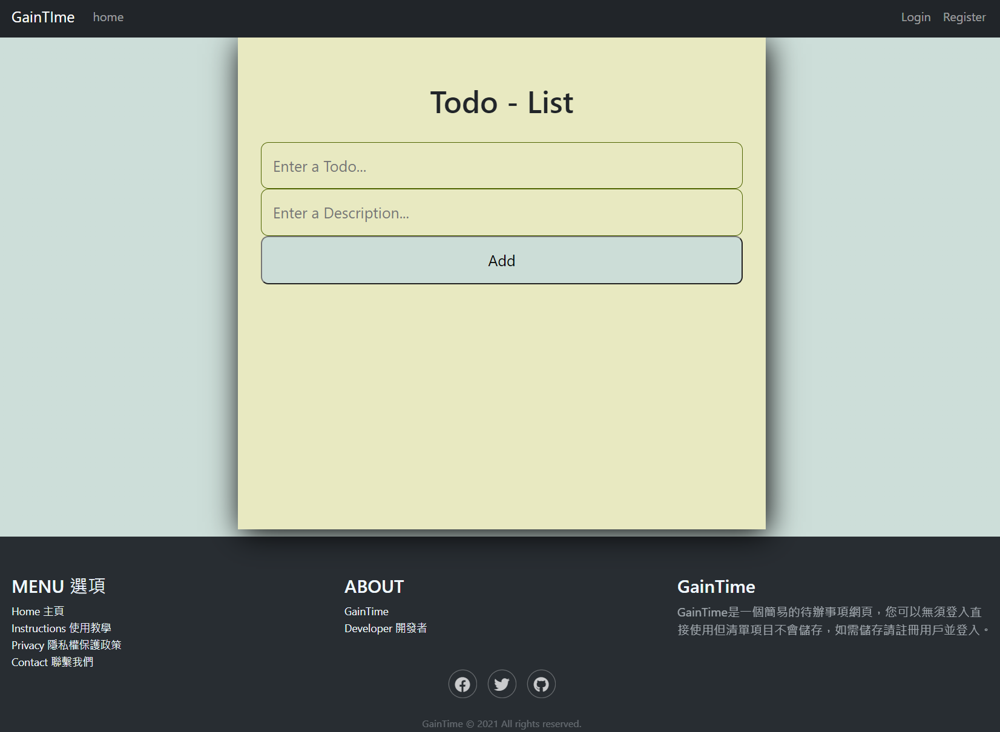
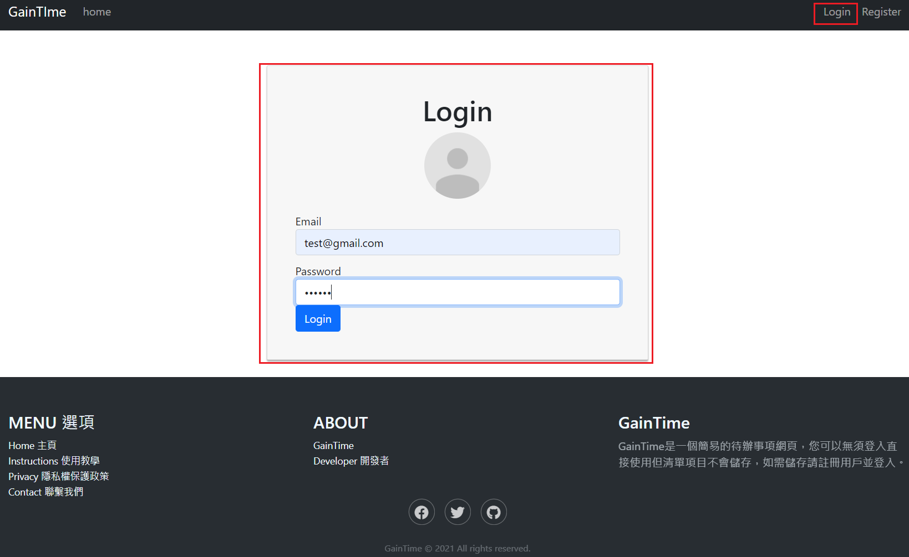
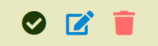
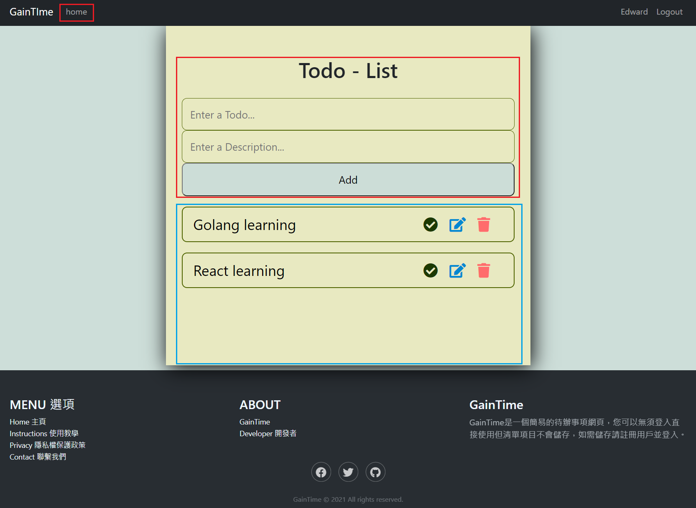

# Todo_demo
利用前端React串接後端Golang-gin與Database Mysql的Restful API全端網站開發。

# Documentation
## 主頁 Home page
url:```https://darkcorner17375.github.io/Todo_demo/```



## 註冊頁面 Register page
1.輸入您的名字（Name）

2.輸入您的信箱（Email）

3.輸入您的密碼（Password）


## 登入頁面 Login page
1.輸入您註冊的信箱（Email）

```test@gmail.com```

2.輸入您註冊的密碼（Password）

```123456```



## 待辦清單 Todo List function
### 新增待辦事項（紅框）
1.輸入 Todo Title（Enter a Todo...）
2.輸入 Todo Description（Enter a Description）
3.點擊 "Add" 新增
4.出現在藍框列表

### 列表功能（籃框）


1.確認功能（checked box）

2.編輯功能（edit box）

3.刪除功能（delete box）

